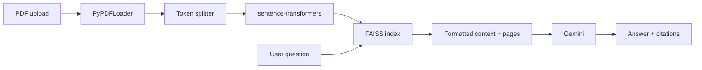

# PDF Conversational Agent

Production-style **strictly grounded** question answering over uploaded PDFs. The backend answers **only** from retrieved document chunks, includes **page citations**, refuses out-of-scope questions, and supports **English and Hindi** queries via prompt instructions to Gemini.

**Evaluators:** see **[`EVALUATORS.md`](EVALUATORS.md)** for a concise architecture note, trade-offs, and test steps.  

## Architecture

1. **Upload (`POST /upload`)** — PDF is saved under `data/`, text is extracted with LangChain `PyPDFLoader`, split with a **tiktoken**-aware `RecursiveCharacterTextSplitter` (~800 tokens, ~100 overlap), embedded with **local HuggingFace `sentence-transformers`** (`HuggingFaceEmbeddings`), and stored in a local **FAISS** index under `vectorstore/<document_id>/`.
2. **Chat (`POST /chat`)** — Questions that look **Hindi-heavy** (Devanagari) are **translated to English once** via Gemini for **retrieval only**, so FAISS search matches English PDF text; the **original** question is still sent to Gemini for the **final** grounded answer (so replies stay in Hindi when you asked in Hindi). English questions skip that step. Top **4** chunks are formatted with **page markers**, then Gemini answers with the **strict** system prompt.
3. **Session model** — One **active** document at a time (`data/manifest.json`). Each new upload replaces the active index (internship-level simplicity).



## Prerequisites

- Python 3.11+
- Enough **RAM/disk** for the chosen embedding model (default `all-MiniLM-L6-v2` is small; first query downloads weights from HuggingFace Hub)
- [Google AI Studio / Gemini API key](https://aistudio.google.com/) for **chat only** (embeddings run locally; no OpenAI key)

## Setup

```bash
cd <path-to-cloned-repo>
python3 -m venv .venv
source .venv/bin/activate
pip install -r requirements.txt
```

Edit `.env`:

- `GOOGLE_API_KEY` — required for Gemini chat.
- `GEMINI_MODEL` — e.g. `gemini-2.0-flash` or a model enabled on your account.
- `HF_EMBEDDING_MODEL` (optional) — HuggingFace model id for `sentence-transformers`, default `sentence-transformers/all-MiniLM-L6-v2`.
- `EMBEDDING_DEVICE` (optional) — e.g. `cuda` or `cuda:0` for GPU; leave unset for library default (often CPU).

**Re-indexing:** You **cannot** convert an existing FAISS index to a new embedding model: stored vectors live in a different space and dimension than the new encoder produces. You must **re-embed the text**. Either upload the PDF again, or call **`POST /reindex`** to rebuild the index for the **active** document from the PDF file already saved under `data/` (same `document_id`, no re-upload).

```bash
curl -s -X POST http://127.0.0.1:8000/reindex
```

## Run the server

From the project root (so `data/` and `vectorstore/` resolve correctly):

```bash
source .venv/bin/activate
uvicorn app.main:app --reload --host 0.0.0.0 --port 8000
```

- API: `http://127.0.0.1:8000`
- Optional UI: open `http://127.0.0.1:8000/` (serves `static/index.html`).

## Try the APIs (curl)

**Health**

```bash
curl -s http://127.0.0.1:8000/health
```

**Upload a PDF** (replace path):

```bash
curl -s -X POST http://127.0.0.1:8000/upload \
  -F "file=@/path/to/your.pdf"
```

**Chat**

```bash
curl -s -X POST http://127.0.0.1:8000/chat \
  -H "Content-Type: application/json" \
  -d '{"question":"What is this document mainly about?"}'
```

Hindi example:

```bash
curl -s -X POST http://127.0.0.1:8000/chat \
  -H "Content-Type: application/json" \
  -d '{"question":"इस दस्तावेज़ का मुख्य उद्देश्य क्या है?"}'
```

## Logging

The server logs **user queries**, **retrieved chunk text** (formatted context), and the **final model response** at INFO level under the `pdf_agent` / `pdf_agent.chat` loggers.

## Testing

Predefined queries in `tests/test_cases.py` target **`tests/fixtures/PM_OneNight_MasterGuide.pdf`** (Product Management “one night” master guide). Upload that file via `POST /upload` (or the UI) before manual chat checks.

**Catalog** (5 valid, 3 invalid + expected behavior):

```bash
python tests/test_cases.py              # prints question rubric only
python tests/test_cases.py --api        # calls /chat for every catalog row (server + upload required)
```

**pytest** (fixture file present + catalog structure + optional live test):

```bash
pytest tests/test_cases.py -q
```

Live HTTP test (server running; **active** PDF should be the PM guide above):

```bash
export RUN_LIVE_API_TESTS=1
pytest tests/test_cases.py::test_live_chat_pipeline -q
```

## Postman

Import `postman/PDF_Agent.postman_collection.json` and set `baseUrl` if needed.

## Error handling

| Situation | Behavior |
|-----------|----------|
| Empty / non-PDF upload | `400` with a clear message |
| PDF with no extractable text | `400` |
| Chat with no prior upload | `400` |
| Retrieval returns nothing | `422` |
| Missing `GOOGLE_API_KEY` / Gemini errors | `503` / `502` with sanitized detail |
| Embedding model download or load failure | `502` on upload with detail |

## Project layout

```
├── app/
│   ├── main.py
│   ├── config.py
│   ├── document_state.py
│   ├── routes/chat.py
│   ├── services/pdf_loader.py
│   ├── services/embeddings.py
│   ├── services/retriever.py
│   ├── services/llm.py
│   └── utils/prompts.py
├── data/                 # uploaded PDFs + manifest.json
├── vectorstore/          # FAISS indices per document id
├── static/index.html     # minimal UI
├── postman/
├── tests/test_cases.py
├── tests/fixtures/PM_OneNight_MasterGuide.pdf
├── requirements.txt
├── .env
└── README.md
```

## Notes

- **Grounding** is enforced by prompt design plus retrieval-only context; always review behavior on your PDFs.
- For **scanned PDFs** without OCR, text extraction may fail — the API returns a clear error.
- **Offline / air-gapped:** set `HF_HUB_OFFLINE=1` and pre-download the model into the HuggingFace cache, or point `SENTENCE_TRANSFORMERS_HOME` to a directory that already contains the weights.
